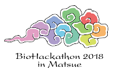

We are pleased to announce that [NBDC](https://biosciencedbc.jp/en/)/[DBCLS](https://dbcls.rois.ac.jp/index-en.html) BioHackathon 2018 will be held at Hotel Ichibata in Matsue, Shimane, Japan.

The BioHackathon series have been proceeding integration of life sciences /  databases with participants from various database providers and projects.
In this year, in addition to our continuous activities on database integration, we will focus on  the development of application cases to the three domains, medical biology, synthetic biology for substance production, and genetics for breeding, in collaboration with the [ELIXIR hackathon](http://bh2018paris.info/).

## Dates

- Symposium
  - December 9th (Sun)
- Hackathon
  - December 10th (Mon) - 15th (Sat)

## Venue and Location

[Hotel Ichibata](https://www.ichibata.co.jp/hotel/) in Matsue, Shimane, Japan

<iframe src="https://www.google.com/maps/embed?pb=!1m18!1m12!1m3!1d3249.5430450989948!2d133.0432376150299!3d35.46610564934782!2m3!1f0!2f0!3f0!3m2!1i1024!2i768!4f13.1!3m3!1m2!1s0x35570516fa20a835%3A0xddd5733c8531e9e!2z44Ob44OG44Or5LiA55WR!5e0!3m2!1sja!2sjp!4v1532657725603" width="600" height="450" frameborder="0" style="border:0" allowfullscreen></iframe>

## Call for Proposals

We will make a call for proposals of development ideas during the hackathon. The authors of excellent ideas will be given travel support (one author per a proposal).

[Proposal submission form (available soon)]()

## Registration

All participants are requested to register yourself to attend the BioHackathon. Regardless of you are invited or not, please fill in the following registration form to participate.

[Registration form (available soon)]()

## Organizers

- Hirokazu Chiba
- Toyofumi Fujiwara
- Susumu Goto
- Toshiaki Katayama
- Shin Kawano
- Shuichi Kawashima
- Jin-Dong Kim
- Mari Minowa
- Yuki Moriya
- Tazro Ohta
- Atsuko Yamaguchi
- Yasunori Yamamoto
